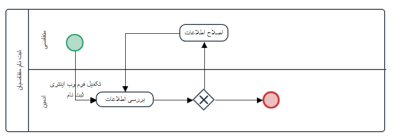

# Signup project

# There are two options for the form:
- Explanation of the translator order registration process:

This form is such that the user enters the specifications and file for translation and approval by the manager, and the translators perform the translation by confirming and giving the suggested amount to the user.
- __Legal__ (The form is specific to a company)

